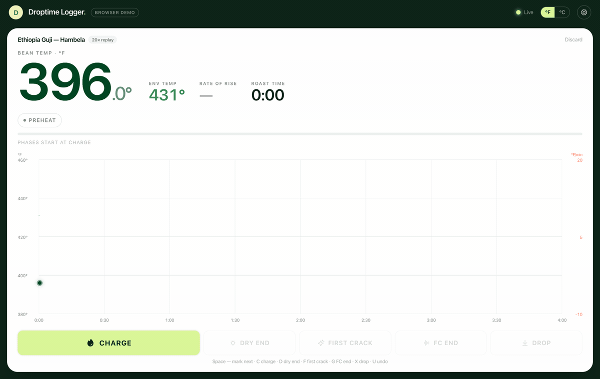

<h1 align="center">Droptime Logger</h1>

<p align="center">
  <strong>A beautiful, local-first roast logger.</strong><br>
  Free forever, open source, and your data never leaves your machine unless you say so.
</p>

<p align="center">
  <a href="https://github.com/OutsideTheBoxDev/droptime-logger/actions/workflows/ci.yml"></a>
  <a href="https://github.com/OutsideTheBoxDev/droptime-logger/releases/latest"></a>
  <a href="LICENSE"></a>
  <a href="CONTRIBUTING.md"></a>
</p>

<p align="center">
  
</p>

<!--
  RELEASE ENGINEER — the hero GIF:
  This is a recording of a real roast played through the built-in simulator/replay
  harness at ~10x speed (the dev tool that replays a captured or fixture roast).
  Record the full CHARGE -> DRY -> FC -> DROP flow, export at ~760px wide, and drop
  it at docs/media/demo.gif before tagging v0.1.0. Keep this path stable so the
  reference never breaks across releases.
-->

---

## Why Droptime Logger

Everything a solo roaster needs to log a roast well, and nothing that gets in the way.

- 🔌 **Live temps in three minutes.** A setup wizard with a real hardware sniffer finds your rig for you, instead of leaving you to guess at ports and baud rates.
- 📊 **The numbers never vanish.** Phase %, DTR, and RoR stay on screen the entire roast, not just for a two-second flash.
- 💾 **Zero data loss.** Force-quit mid-roast and recover losslessly — every sample hits the disk before it hits the screen.
- 📈 **60fps-smooth curves** with honest math underneath. No fake smoothing hiding what your probes actually saw.
- 📦 **Native and tiny.** Real Apple Silicon and Windows installers, around 15 MB. Not a Python/Qt bundle.
- 👻 **Roast against a previous roast.** Load any past roast as an aligned ghost curve, with spoken cues as the milestones approach.
- 🎯 **Auto CHARGE/DROP detection**, on by default. The roast marks itself; you can still tap it yourself any time.

## A scope, not a controller

**Droptime Logger is a roast scope and analytics tool, not a roast controller.** It reads temperatures; it never actuates hardware. There is no PID, no burner control, and no alarm action that touches your machine. Alerts and cues speak to *you* — the roaster stays in your hands. This is a deliberate design line, not a missing feature: it keeps the app safe to run alongside any setup and honest about what it does.

## Hardware support

We would rather tell you the truth than pad a compatibility list. Here is exactly where v0.1.0 stands.

| Device | Status | Notes |
|---|---|---|
| TC4 / aArtisanQ-compatible serial | ✅ Supported | Includes TC4-emulating DIY builds and many Skywalker setups. Read-only. |
| Replay / simulator | ✅ Supported | Log a full roast with **zero hardware** — great for trying it out. |
| Phidgets | 🛠️ v0.2 | In progress. |
| MODBUS (Loring / Giesen / Probat-class) | 🛠️ v0.2 | On the roadmap. |
| Aillio Bullet R2, Kaleido | 🔬 Investigating | Clean-room only. **Device reports welcome** — see below. |

**Own a machine we don't support yet?** Ten minutes of your time gets your rig on the roadmap. Open a [device report](https://github.com/OutsideTheBoxDev/droptime-logger/issues/new?template=device-report.yml) — the in-app sniffer has a **Copy diagnostic** button that pastes your port, frame dump, and hardware details straight into it.

## Install

Download the latest build for your platform from the [Releases page](https://github.com/OutsideTheBoxDev/droptime-logger/releases).

### macOS

Grab the `.dmg` (Apple Silicon or Intel). v0.1.0 is **not yet notarized**, so the first launch needs one extra step: **right-click the app → Open → Open**. You only do this once. Code signing and notarization land in v0.1.1.

<p align="center">
  
</p>

<!-- RELEASE ENGINEER: capture the macOS "unidentified developer -> Open" dialog and save it at docs/media/macos-open.png. Remove this note and the placeholder once notarization ships in v0.1.1. -->

### Windows

Grab the `.exe` (NSIS) installer. Because the build is unsigned for now, SmartScreen may warn you: click **More info → Run anyway**. Code signing is planned.

### Linux

An experimental `AppImage` is published on a best-effort basis. Linux is not a supported tier yet — it may work well for you, but we can't promise it.

### Build from source

```sh
# Prerequisites: pnpm >= 9, Node >= 20, Rust >= 1.82 (stable)
pnpm install
pnpm tauri dev      # run the desktop app in development
pnpm build          # production build
pnpm test           # vitest + cargo test
```

## Quick start

Three ways in, depending on what you have in front of you.

1. **Connect a roaster.** Launch the app and let the setup wizard run. It scans your serial ports, recognizes common adapters (FTDI, CP210x, CH340) by name, listens for a TC4 frame, and walks you through assigning your BT/ET channels. If the sniffer can't guess, a manual port/baud picker is always one click away.
2. **Try the demo with zero hardware.** Pick **Try the demo** in the wizard. The replay source drives a full roast so you can see the live curves, phase math, and markers before you own a single probe.
3. **Import your Artisan history.** Drag your `.alog` files onto the import drop zone. Droptime parses them locally, shows you a count and a preview, and files them into your history — no re-typing, no cloud round-trip.

## Your data is yours

Every roast lives in a local SQLite database on your machine. That's the whole storage story — there is no account to create and no telemetry. The app's only network call is a once-daily, read-only check of GitHub Releases for new versions; no roast data or identifiers are sent.

When you want your data somewhere else, take it: **export any roast to `.alog`, CSV, or JSON** whenever you like. Import runs the same way, offline, from a drag-and-drop. Local-first isn't a marketing word here; it's the only mode the Logger has.

## A few features worth knowing

**Roast against a previous roast.** Pick any prior roast — or an imported `.alog` — as your reference at setup. Its curve rides along on the live chart, aligned at charge, with upcoming-event cues as you go: a chip (and an optional spoken line) telling you *"first crack on the reference in about 30 seconds."* It's a playback aid for your eyes and ears only; it never drives your machine.

**Auto CHARGE/DROP.** The Logger watches the temperature signature and marks CHARGE and DROP for you, on by default. The detection works from first principles rather than a pile of alarm settings, so it's robust out of the box — and if you'd rather mark by hand, the keyboard flow is right there.

**Simple alerts.** Set a trigger — a BT threshold, or a time after an event — and choose how it reaches you: a notification, a sound, or a spoken cue. Alerts are read-only by design: they tell *you* what's happening and let you make the call.

## Droptime Cloud

The Logger is complete and free, forever. If you later want sync across devices, AI roast readouts, or team, inventory, and wholesale tools, [Droptime Cloud](https://trydroptime.com) is the optional paid layer that adds them. We keep this seam honest and visible: it's a single **"coming soon"** card in Settings, and nothing about the free app changes if you never touch it.

## Contributing

Contributions are genuinely welcome — especially drivers and device reports. A couple of things to know before you open a PR:

- **We use a CLA.** A lightweight bot asks you to sign once, with a single comment, on your first PR. It lets contributions flow into Droptime's commercial products later while you keep your copyright.
- **Drivers are clean-room.** To keep this project legally clean for everyone, driver and file-format work must document its protocol provenance (vendor docs, your own hardware captures, or permissively-licensed references). Porting or paraphrasing GPL code — Artisan's or anyone's — is an automatic close.

Full details, the sanctioned-inputs list, and the provenance checklist live in [CONTRIBUTING.md](CONTRIBUTING.md).

## Community

Questions, roasts, and feature ideas belong in [GitHub Discussions](https://github.com/OutsideTheBoxDev/droptime-logger/discussions). Bugs and device reports go through the [issue templates](https://github.com/OutsideTheBoxDev/droptime-logger/issues/new/choose).

## License

- The **app, console UI, capture engine, and `@droptime/roast-console`** are licensed under **[AGPL-3.0-only](LICENSE)**.
- The **protocol documentation** under [`docs/protocols/`](docs/protocols/) is licensed under **Apache-2.0**, so it stays a friendly touch layer for vendors and contributors.
- When the standalone **driver SDK** crate splits out (v0.2, alongside the Phidgets driver), it will ship under **Apache-2.0**. That's a commitment, in writing.

See [NOTICE](NOTICE) and [THIRD-PARTY-NOTICES.md](THIRD-PARTY-NOTICES.md) for attribution of the open-source libraries we build on.

## Acknowledgments

- **[Artisan](https://artisan-scope.org).** Fifteen years of open-source roast software have shaped what roasters expect from a logger, and it shows. We aren't trying to replace it — we're pointing at a narrower target (setup, scope, and analytics), and the coffee world is better for having both.
- **The aArtisanQ / TC4 community**, whose BSD-3-Clause `commands.txt` documents the serial protocol our first driver speaks.
- **The coffee community** — r/roasting, Home-Barista, and every roaster who has ever posted a curve and asked *"what happened here?"* This is for you.

<p align="center"><sub>Built by <a href="https://trydroptime.com">Droptime</a> · Maintained by <a href="https://github.com/RyanLuttrell">@RyanLuttrell</a></sub></p>
